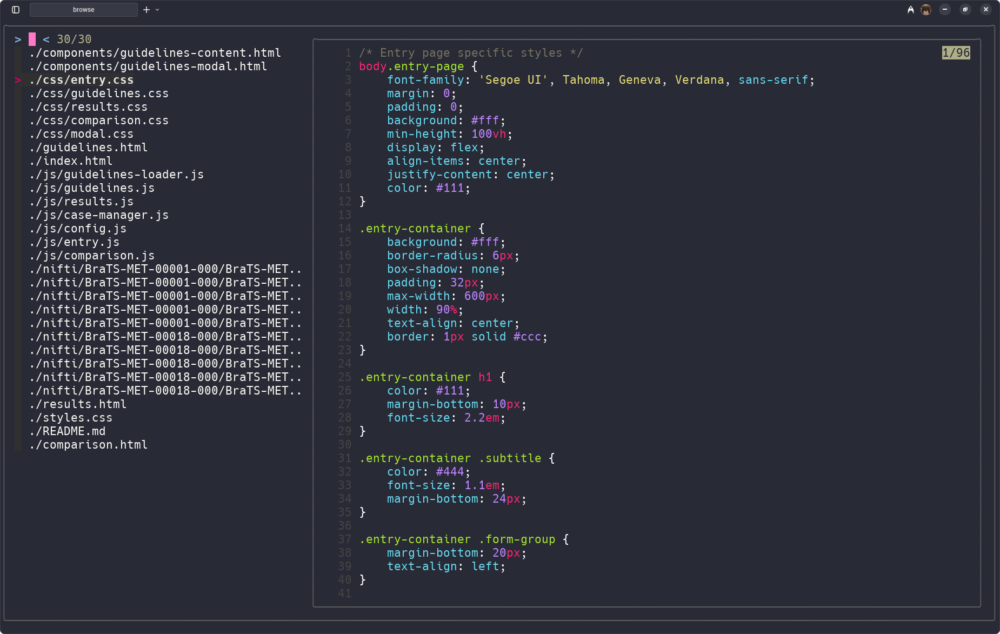
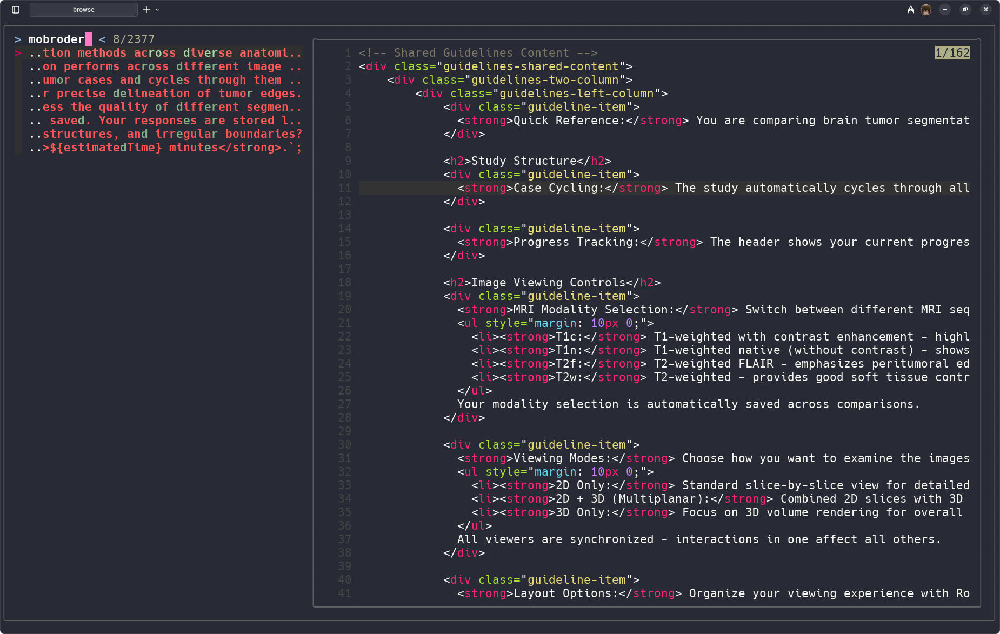

# Scout: File Browsing and Searching Tool

Scout combines [fzf](https://github.com/junegunn/fzf), [bat](https://github.com/sharkdp/bat), and [ripgrep](https://github.com/BurntSushi/ripgrep) for interactive file browsing and searching.

---

## Examples

### File Browsing



### Text Searching



---

## Requirements

- [fzf](https://github.com/junegunn/fzf)
- [bat](https://github.com/sharkdp/bat)
- [ripgrep](https://github.com/BurntSushi/ripgrep)

---

## Installation

Add to alias:

```bash
alias browse='src.sh'
```

Reload your shell config:

```bash
source ~/.bashrc  # or its equivalent.
```

---

## Usage

Run `browse` and press **F2** to toggle modes.

```bash
browse
```